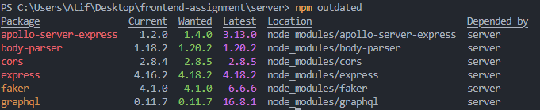

## Tasks

[x] Fork the repo: https://github.com/arunoda/next-apollo-demo This is a basic app using Next.js &amp; Apollo GraphQL.
[] Update Next.js, React, Apollo GraphQL to the latest versions.
  [x] Update Server
  [x] Update Client
[x] Refactor the code as deemed fit. Brownie points if you use some of the latest features of react like Hooks, Suspense Lazy etc. More brownie points if you use TypeScript. 
[x] Create a GraphQL Query and Resolver that will generate a dummy list of about 2000 names with their addresses, email and phone numbers. Feel free to use any fake data generator library, btw love https://www.npmjs.com/package/casual 
[x] Create a New Page in Nextjs where you display these names and addresses as a grid of card tiles. The page needs to be responsive. 
[x] Implement Lazyloading / Infinite scrolls so that you load 20 cards each time you click a ‘Load More’ button, which you would need to create. 
[x] Add Unit Tests using Jest and React Testing Library. 
[x] Dockerize the server and client app and use docker-compose so that we can run the app locally using docker-compose. Bonus Task. 

[x] Deploy your App on Heroku. And send us a link to the app. 
[] Write cypress end to end test for the page you created.

## Notes

### Update Next.js, React, Apollo GraphQL to the latest versions.
1. Ran `npm outdated` on server

2. Removed faker
3. Replaced `apollo-server-express` with `@apollo/server`
4. Added `casual` and finished resolver with pagination support
5. Cleaned up unnused files, Updated `.gitignore` and removed `.next` from repo
6. Nothing worth salvaging from client app so deleted everything and `yarn create next app`
7. Setup nextjs v14 with new app router
8. Added `@tailwind` support
9. Added Apollo-Client
10. Added Pagination Support
11. Added Suspense with LoadingCard

### Heroku Deployment steps

* `cd server`
* `heroku container:login`
* `heroku apps:create next-apollo-client`
* `heroku config:set NEXT_PUBLIC_API_URI=https://example -a next-apollo-client`
* `heroku container:push web -a next-apollo-client`
* `heroku container:release web -a next-apollo-client`
* `heroku open -a next-apollo-client`

### Debugging and logs
* `heroku run bash -a next-apollo-client`
* `heroku logs:drains -a next-apollo-client`