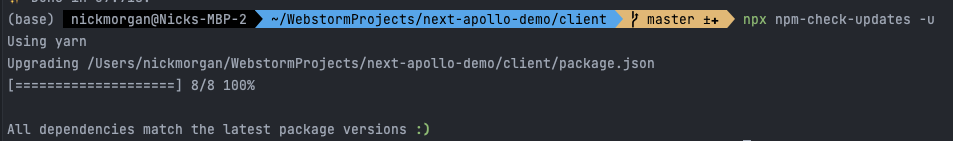
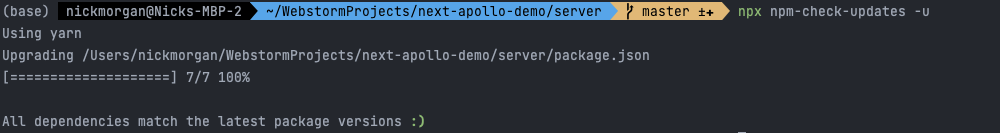

# Nick Morgan Technical Test

### Technical Test Checklist:
- [x] Fork the repo: https://github.com/arunoda/next-apollo-demo This is a basic app using Next.js & Apollo GraphQL.
- [x] We would like you to update Next.js, React, Apollo GraphQL to the latest versions.
- [x] Refactor the code as deemed fit. Brownie points if you use some of the latest features of react like Hooks, Suspense Lazy etc. More brownie points if you use TypeScript.  
- [x] Create a GraphQL Query and Resolver that will generate a dummy list of about 2000 names with their addresses, email and phone numbers. Feel free to use any fake data generator library, btw love https://www.npmjs.com/package/casual
- [x] Create a New Page in Nextjs where you display these names and addresses as a grid of card tiles.  The page needs to be responsive.
- [x] Implement Lazyloading  / Infinite scrolls so that  you load 20 cards each time you click a ‘Load More’ button, which you would need to create.  
- [ ] Add Unit Tests using Jest and React Testing Library.
- [ ] Dockerize the server and client app and use docker-compose so that we can run the app locally using docker-compose.
- [ ] Deploy your App on Heroku. And send us a link to the app.
- [ ] Write cypress end to end test for the page you created.

### Package Updates:
I used npm-check-updates to help with this, as it's often safer than just manually upgrading. The following is the success message for the client:

I also took the liberty of updating the server too:

### Refactoring Steps:
- First I added typescript to the `client` and `server`. Then I ran `yarn tsc --init` to generate a `tsconfig.json` file.
- I then changed all the files to `.tsc` and `.ts` respectively.
- I changed the server over to ES6 modules.
- I updated the client and server to use the latest versions of apollo and remove deprecated apollo versions. @apollo/server for backend and @apollo/client for front-end.

### Server Refactoring Steps Taken:
- First I changed the folder structure so all important files are in a `src` directory.
- I then created a `graphql` directory with two new directories `resolvers` and `typeDefs` which house my resolver and typedefs files.
- I updated the `server.ts` file to be `index.ts` and refactored the server code to the @apollo/server v4 configuration.
- I added the `colors` package to give my console logs some flavour and I also added `dotenv` to easily add `.env` files.
- I set the graphql playground to `/graphql`.
- I decided it would be easier to simply create a `Query` which when called will automatically generate dummy data, as opposed to making a mutation to create users and hooking this up to a database (MongoDB, Postgre, MySQL). 
- I set up the query definition for the `Employee` in the `typeDefs/index.ts` file, I also create a query `employees` which expects an array of employees.
- I then set up my resolver in the `resolvers/index.ts` file. I also created an `Employee` typescript entity definition for the resolver to check against.
- I then created the  `employees` query, which when called will generate a list of 2,000 users with the dummy data from the `casual` package. This query will then return an array of `Employees` matched against the type entity.
- I also used math.Random to generate the id's for each employee. 
- This was all I did to the server, I simply removed all un-used files and packages after this. 
- Additionally, I assumed as this was more of a front-end heavy test (and I didn't set up a full backend project with a database) that I didn't need to write tests for this.

### Client Refactoring Steps Taken:
- First I changed the folder structure to better cater to a potential enterprise project. This included:
- - Adding a `src` directory.
- - Adding a `components` directory.
- - Adding an `entities` directory.
- I also set up tailwind css for the project, so it would be easy to style the front-end quickly. 
- In the `lib` folder I created an `apollo-client.ts` file, which is used to connect with the apollo graphql backend.
- I also created a `.env.local` file in line with nextJS's environment criteria, to store my apollo-graphql url.
- I then ensured a `ApolloProvider` was added to the `_app.tsx` file and that I passed in the `client` from the aforementioned `apollo-client.ts` file.
- Next, I created a `header` component `components/header/index.tsx` file. This file is just a simple header to navigate between pages. I added a link to the `home` `employees` and my `github`.
- I tested this for mobile and tablet then I created a `header.spec.tsx` file and tested the component thoroughly.
- For the tests to work I had to add `@testing-library/react` and `jest` to the project. I had to set these files up for my tests to work.
- I also created two new commands on the `client` `package.json`: `test` and `test:coverage`.
- **IMPORTANT** I used the `"DNIYJ" format (Don't Nest If You Jest) `throughout all the unit tests. I think this is the most legible way to write tests.
- Once the above was complete, I added this new `header` component to my home page `pages/index.tsx`.
- Next I created a `button`` component that has simple props `label` `className` and `onClick`. I then created a test suite for this.
- Once the above were complete I started working on the `team-card` component. I intended for this to be the styles of how each employee is displayed within the grid on the `employees` page.
- I simply had the component receive a `employee` prop, which was type matched to the `employee` entity. This simple deconstructed the elements from the employee prop, such as `firstName`, `lastName`, `email` et cetera.
- Once the above was complete I added tests for this component. 
- Now all my components were built and tested I moved onto creating the employees page `pages/employees/index.tsx`. This page had a few unique things on it:
- - I added serverSideProps which connected to the graphql `client` I created earlier in `apollo-client.ts` and retrieved the `employee` data from the server. This was then sent to the page as props.
- - I set up a `loadMoreLimit` state value which on inception is set to a value of 20. This will help us increase the visible employees on each button click.
- - I deconstructed the `employee` data from the serverSideProps.
- - I created a div which is a grid with 4 columns and iterated through every `employee`. I sent this `employee` data to the `Team Card` component to be rendered separately from our array map function.
- - I added our load-more button and created a `handleOnClick` function which adds 20 more employees to the loadMoreLimit. I ensured to slice our array map from 0 to the limit in this state variable.
- - I tweaked with some CSS and ensured it was fully responsive. 

### Additional Information:
- I added a package.json to the project root, so I could add global prettier to dev dependencies for development.
- I also added concurrently to the root, so I could run `yarn dev` so the server and client would launch at the same time.
- I changed the server port to `8000` because it's my preference and added `.gitignore` files to the client & server, alongside `.env` files.
- I added a `yarn setup` command on the root file which automatically installs dependencies everywhere.
- I added a package `npm-check-updates` to safely update dependencies to the latest versions.
- I added an assets file to add images to the `README.md`.

